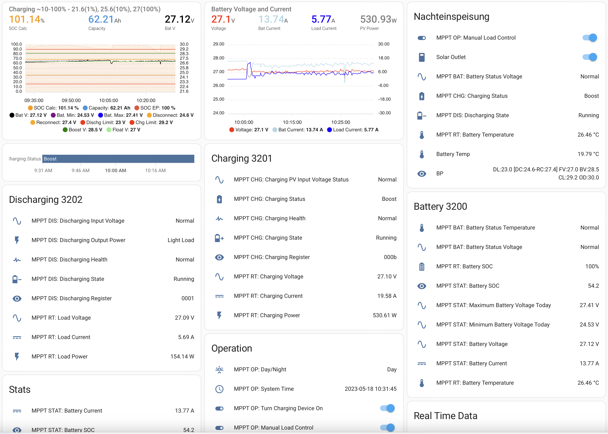

# ESPHome for Tracer Solar Charger: Advanced Control, Monitoring, and Home Assistant Integration

ESPHome, an open-source framework designed for IoT devices, now offers a comprehensive package specifically tailored for Tracer Solar Chargers. By utilizing ESP8266 or ESP32 microcontrollers, this package enables seamless integration and advanced customization of your Tracer Solar Charger, allowing you to optimize its performance, monitor its key parameters, and integrate it with Home Assistant for a complete smart home solution.



## Key Features and Benefits:

Easy Configuration: ESPHome simplifies the configuration process by providing a user-friendly and intuitive configuration language. With just a few lines of code, you can monitor and define the behavior of your Tracer Solar Charger.

Real-time Monitoring: Keep a close eye on your solar charging system's performance with real-time monitoring capabilities. Monitor critical parameters such as solar panel voltage, charging current, battery voltage, and charging status, directly from your smartphone or any connected device. Integrate this data into Home Assistant for comprehensive visualization and logging.

Intelligent Charging Algorithms: ESPHome allows you to implement intelligent charging algorithms to optimize the charging process. By considering factors such as battery health, time of day, and available solar power, you can dynamically adjust charging parameters to ensure maximum efficiency and extend the lifespan of your batteries.

Home Assistant Integration: Seamlessly integrate your Tracer Solar Charger with Home Assistant, a popular open-source home automation platform. This integration enables you to incorporate your solar charging system into automated routines, create visual dashboards, and trigger actions based on charging events. Monitor the status of your Tracer Solar Charger alongside other smart devices in your home for a unified and centralized control experience.

Over-the-Air (OTA) Updates: ESPHome supports OTA updates, allowing you to remotely update the firmware and configuration of your Tracer Solar Charger. This ensures that you always have access to the latest features and improvements without the need for physical intervention.

Expandability and Customization: ESPHome's modular architecture enables you to extend the capabilities of your Tracer Solar Charger. Add additional sensors, such as temperature, to gather more data about your charging environment. Implement custom automations and notifications based on specific charging conditions or events within Home Assistant.

From fine-tuning charging parameters to monitoring real-time performance and seamlessly integrating with Home Assistant, this powerful combination empowers you to optimize efficiency, enhance battery health, and create a comprehensive smart home ecosystem.

# Usage

## Prerequisites

Your require a hardware setup for a Modbus Controller Interface like described on the [ESPHOME Website](https://esphome.io/components/modbus_controller.html)

Adjust setting in the header of epever_mppt_controller.yaml:

```
substitutions:
  name: tracer
  prefix: "MPPT"
  update_interval: 10s
  disabled_by_default: "true"
  DI: GPIO19    # TX Pin
  RO: GPIO18    # RX Pin
  REDE: GPIO23  # RE/DE Pin
  timezone: "Europe/Berlin"
```

Then just run esphome run `epever_mppt_controller.yaml` and you are good to go!
Homeassitant will autodiscover your device and you can start to configure your dashboard.

The dashboard example in `tools/ha.tracer.example.yaml` requires the following HA Lovelace Plugins:
- [auto-entities](https://github.com/thomasloven/lovelace-auto-entities)
- [custom:apexcharts-card](https://github.com/RomRider/apexcharts-card)
